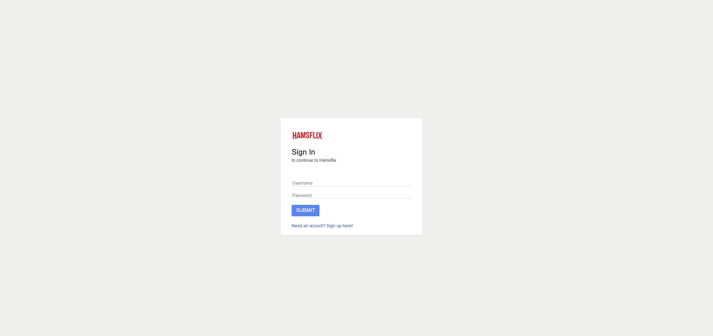
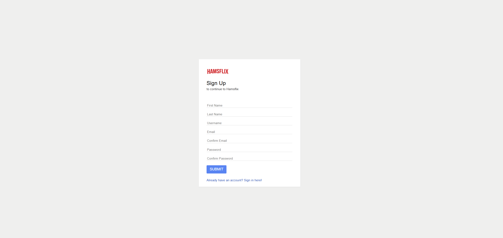
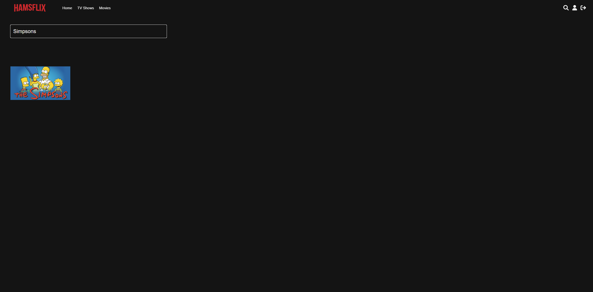
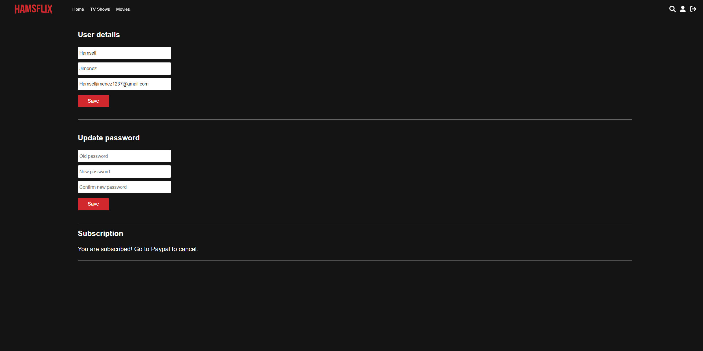

# Hamsflix

<p align="center">
  
</p>

<p align="center">
  A Netflix-style streaming web app built with PHP, MySQL, and PayPal subscriptions.
</p>

<p align="center">
  
  
  
  
  
</p>

## Overview

Hamsflix is a local streaming platform prototype with authentication, content browsing, search, video playback tracking, and a subscription flow with PayPal.

## Live Demo

You can also try the deployed version here:

- [http://hamsflix.infinityfreeapp.com/login.php](http://hamsflix.infinityfreeapp.com/login.php)

Note: for the live site, users need to create their own account first.
## Features

- User registration, login, and logout
- Profile management (account details and password updates)
- Category-based browsing (movies and TV shows)
- Search by content name
- Video player with progress tracking and "Up Next"
- PayPal subscription integration

## Tech Stack

| Layer | Technology |
|---|---|
| Backend | PHP (PDO) |
| Database | MySQL / MariaDB |
| Frontend | HTML, CSS, JavaScript, jQuery |
| Payments | PayPal REST SDK |
| Local Environment | XAMPP |

## Demo Credentials

Imported from `database/hamsflix.sql`:

- Username: `demo`
- Password: `demo123`
- `isSubscribed`: `0` (not subscribed)

This is intentional so users can test the subscription process inside the app. After a successful subscription flow, the app updates it to `1`.

## Quick Start (XAMPP)

1. Place the project in:
   - `C:\xampp\htdocs\hamsflix`
2. Start **Apache** and **MySQL** in XAMPP.
3. Import the bundled database file:
   - `database/hamsflix.sql`
4. Update database credentials in `includes/config.php`:

```php
$con = new PDO("mysql:dbname=YOUR_DB_NAME;host=YOUR_DB_HOST", "YOUR_DB_USER", "YOUR_DB_PASSWORD");
```

5. Update PayPal credentials in `includes/paypalConfig.php`:

```php
new \PayPal\Auth\OAuthTokenCredential(
    'YOUR_PAYPAL_CLIENT_ID',
    'YOUR_PAYPAL_CLIENT_SECRET'
)
```

6. Open:
   - `http://localhost/hamsflix`

## Required Configuration for New Environments

- Replace database credentials in `includes/config.php`.
- Create a PayPal Sandbox app and replace credentials in `includes/paypalConfig.php`.

## Project Structure

- `index.php`: Home page with preview and categories
- `watch.php`: Video playback page
- `login.php` / `register.php`: Authentication
- `profile.php`: Profile and subscription status
- `billing.php` / `billingPlan.php`: PayPal subscription flow
- `ajax/`: Search and watch-progress endpoints
- `includes/classes/`: Core domain logic
- `entities/`: Media assets (`videos`, `previews`, `thumbnails`)

## Screenshots

### Login


### Register


### Home


### Search


### Demo


## Notes

- Video/image paths are loaded from the database (`filePath`, `thumbnail`, `preview`).
- `watch.php` requires a subscribed account to play content.
- Use PayPal Sandbox credentials for testing.

